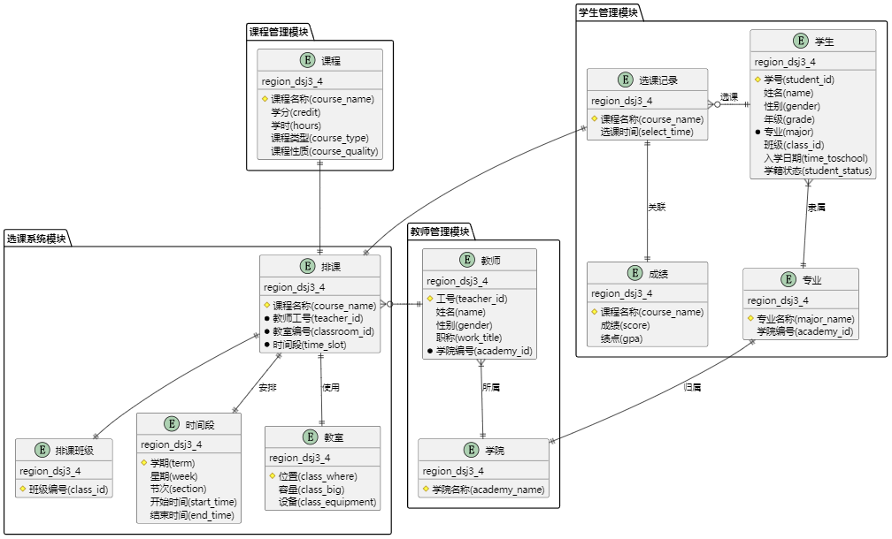

# 教务信息管理系统开发文档(region_dsj3_4)                   Database_Development               

## 目录
- [项目概述](#项目概述)
- [数据库设计](#数据库设计)
  - [ER图设计](#ER图设计)
  - [逻辑模型](#逻辑模型)
- [核心功能实现](#核心功能实现)
  - [冲突检测算法](#冲突检测算法)
  - [成绩异常分析](#成绩异常分析)
- [Flask Web应用开发](#flask-web应用开发)
  - [项目结构](#项目结构)
  <!-- - [模板示例](#模板示例) -->
- [系统优化与部署](#系统优化与部署)
  - [索引优化](#索引优化)
  - [缓存机制](#缓存机制)
  - [生产环境部署](#生产环境部署)
- [后续优化方向](#后续优化方向)
- [项目仓库](#项目仓库)

---

## 项目概述

本项目为实现"region_dsj3_4"教务信息管理系统的流程管理，涵盖**教师管理、学生管理、课程排课、选课管理、成绩统计**等功能。系统基于以下技术栈：
- **前端**：LayUI框架
- **后端**：Python + Flask
- **数据库**：MYSQL
- **AI辅助**：ai模型生成SQL
---

## 数据库设计

### ER图设计

  
**核心实体**：
```sql
学生(学号, 姓名, 年级, 专业, 班级)
教师(工号, 姓名, 性别,职称, 学院)
...
```
### 逻辑模型
待补充

## 核心功能实现
待补充

### 冲突检测算法
待补充

### 成绩异常分析
待补充

## Flask Web应用开发
待补充

### 项目结构
```
Database_Development/
├── database/     # 数据库相关文件
│   └── models.py # 数据库模型
│  
├── backend/      # 后端逻辑
│   ├── 
│   └── 
│  
├── templates/    # 前端模板
│   ├── base.html
│   ├── index.html
│   ├── 
│   └── 
│  
├── static/    
│   ├── css/
│   └── js/
├── image/
├── config.py     # 配置文件
└── run.py        # 启动脚本

```

## 系统优化与部署
待补充

## 后续优化方向
待补充

## 项目仓库
[github仓库](https://github.com/SweCui/Database_Development.git)


